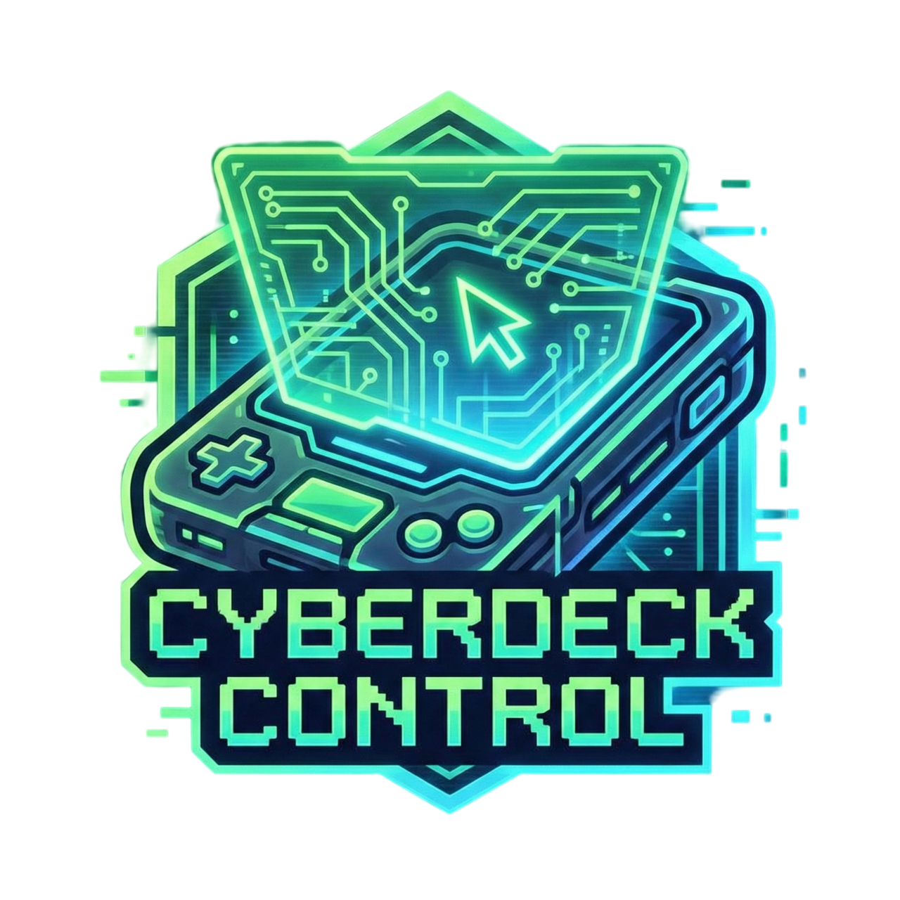

  

<h1 align="center">CyberDeck Control — удаленное управление ПК</h1>

  
  
  

  Управление компьютером со смартфона в локальной сети: подключение по PIN/QR, ввод, видеопоток, передача файлов и разрешений для устройств.

  <a href="#функции-приложения">Функции</a> •
  <a href="#сценарии-использования">Сценарий работы</a> •
  <a href="#базовые-жесты">Жесты</a> •
  <a href="#faq">FAQ</a>

  
  

  

---

## ✨ Функции приложения

- Подключение устройства по PIN или QR.
- Удаленное управление мышью, клавиатурой и медиа-клавишами.
- Видеопоток экрана (MJPEG / H.264 / H.265 в зависимости от среды).
- Передача файлов между телефоном и ПК в обе стороны.
- Системные действия: питание/громкость.
- Лаунчер с локальным мониторингом статуса, устройств и QR.
- Раздельные права доступа для каждого устройства.

### Права устройства

- `perm_mouse` — управление мышью.
- `perm_keyboard` — управление клавиатурой/вводом.
- `perm_stream` — доступ к видеопотоку.
- `perm_upload` — загрузка файлов на ПК.
- `perm_file_send` — отправка файлов с ПК на устройство.
- `perm_power` — системные действия (питание/громкость).

---

## 📱 Сценарий использования

1. Запусти CyberDeck на ПК.
2. Открой мобильный клиент: <https://github.com/Overl1te/CyberDeck-Mobile>.
3. Подключись по QR или введи IP/порт/PIN.
4. Выбери устройство и управляй ПК.

---

## 🖐 Базовые жесты

| Жест | Действие |
|---|---|
| 1 палец (движение) | Перемещение курсора |
| 1 палец (тап) | ЛКМ |
| 2 пальца (движение) | Скролл |
| 2 пальца (тап) | ПКМ |
| Удержание + движение | Drag & Drop |

---

## 🧩 Платформы

- Windows / Linux / macOS.
- Доступные видео-кодеки и бэкенды зависят от окружения ОС.

---

## 📚 Техническая документация

В `README` оставлены только функции приложения и пользовательский сценарий.

Вся техническая часть перенесена в `CONTRIBUTING.md`:

- актуальная структура модулей: `cyberdeck/api`, `cyberdeck/video`, `cyberdeck/ws`, `cyberdeck/launcher`, `cyberdeck/input`, `cyberdeck/platform`;
- разделение зависимостей: `requirements-core.txt` и `requirements-desktop-input.txt`;

- установка из исходников;
- запуск в разных режимах;
- API и эндпоинты;
- тестирование;
- сборка и упаковка.

Практические гайды:

- Docker runtime: `docs/DOCKER.md`
- Диагностика стрима/аудио/паринга: `docs/STREAMING_TROUBLESHOOTING.md`

---

## ❓ FAQ

**В: Устройство не подключается.**  
О: Проверь, что ПК и смартфон в одной сети, а IP/порт/PIN актуальны.

**В: Можно ли ограничить доступ конкретному устройству?**  
О: Да, для каждого устройства задаются отдельные права (`perm_*`).

**В: Почему на разных ОС разное качество/тип видеопотока?**  
О: Путь стрима зависит от доступных системных бэкендов и кодеков.

---

**Лицензия:** GNU GPLv3 (`LICENSE`)  
**Автор:** Overl1te — <https://github.com/Overl1te>

